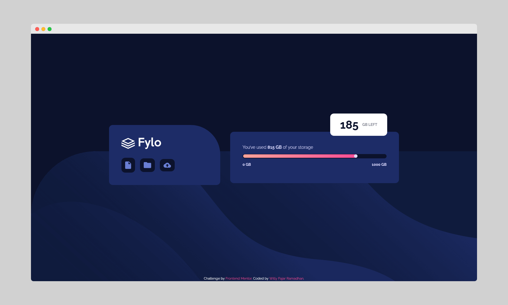
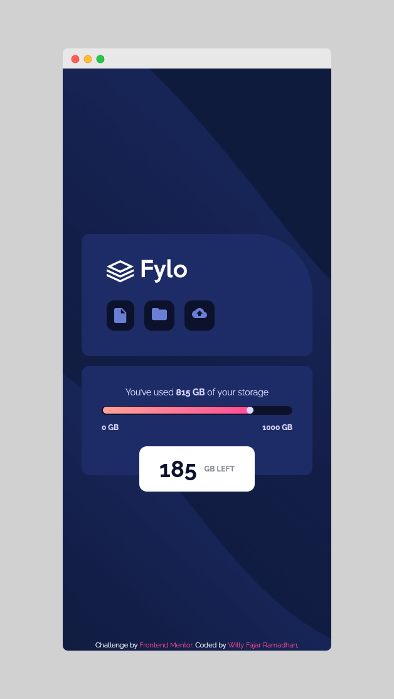

# Frontend Mentor - Fylo data storage component solution

This is a solution to the [Fylo data storage component challenge on Frontend Mentor](https://www.frontendmentor.io/challenges/fylo-data-storage-component-1dZPRbV5n). Frontend Mentor challenges help you improve your coding skills by building realistic projects. 

## Table of contents

- [Overview](#overview)
  - [The challenge](#the-challenge)
  - [Screenshot](#screenshot)
  - [Links](#links)
- [My process](#my-process)
  - [Built with](#built-with)
  - [What I learned](#what-i-learned)
- [Author](#author)

**Note: Delete this note and update the table of contents based on what sections you keep.**

## Overview

### The challenge

Users should be able to:

- View the optimal layout for the site depending on their device's screen size

### Screenshot
Desktop preview:


Mobile preview:


### Links

- [Solution URL](https://github.com/wllyvx/frontendmentor-fylo-data-storage)
- [Live Site](https://wllyvx.github.io/frontendmentor-fylo-data-storage/)

## My process

### Built with

- CSS custom properties
- Flexbox
- Mobile-first workflow
- [TailwindCSS](https://tailwindcss.com) - For styles

### What I learned

I learnded to make a static progress bar

```html
<div id="progress-bar" class="w-full bg-very-dark-blue rounded-xl p-[.1rem]">
    <div id="progress-bar-color" class="w-[80%] flex justify-end bg-gradient-to-r from-grad-start to-grad-end rounded-xl">
        <div id="ball" class="w-[.7rem] h-[.7rem] bg-pale-blue rounded-full"></div>
    </div>
 </div>
```

## Author

- Willy Fajar Ramadhan
- Frontend Mentor - [@wllyvx](https://www.frontendmentor.io/profile/wllyvx)
- Github - [wllyvx](https://github.com/wllyvx)
- Twitter - [@willyframadhan](https://www.twitter.com/willyframadhan)
